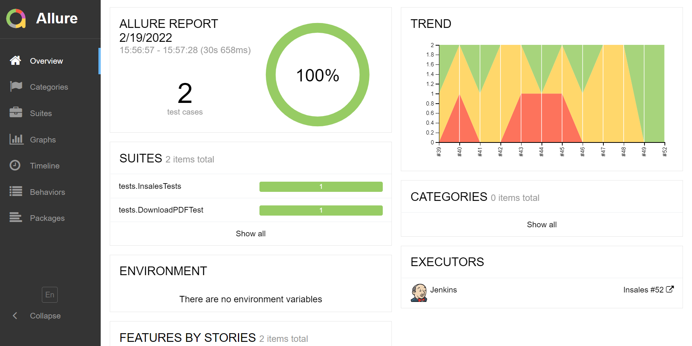
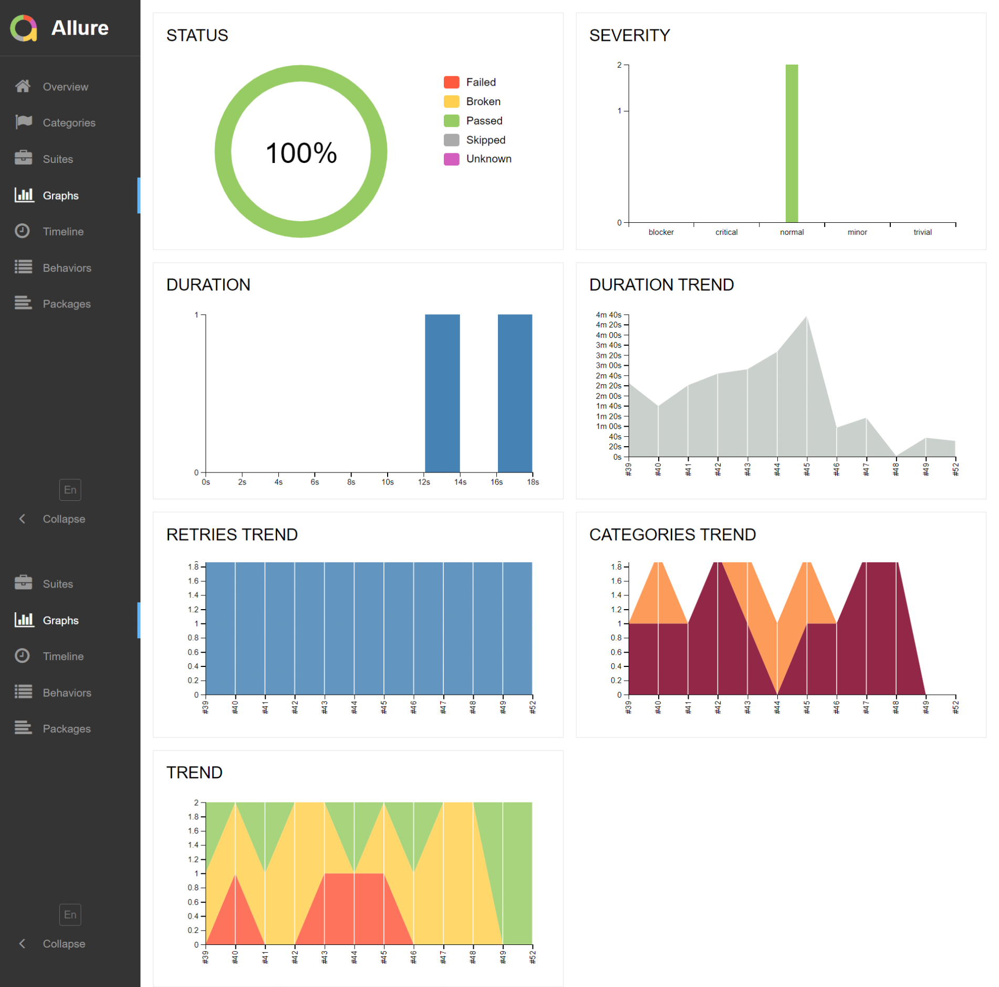
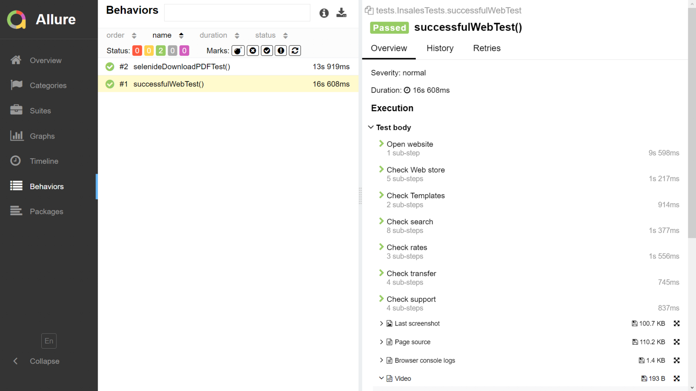
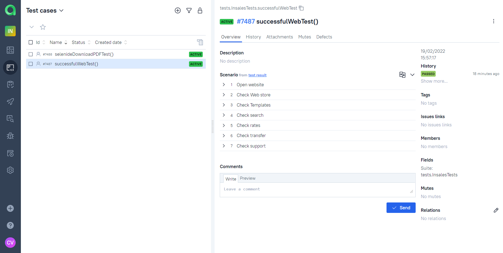
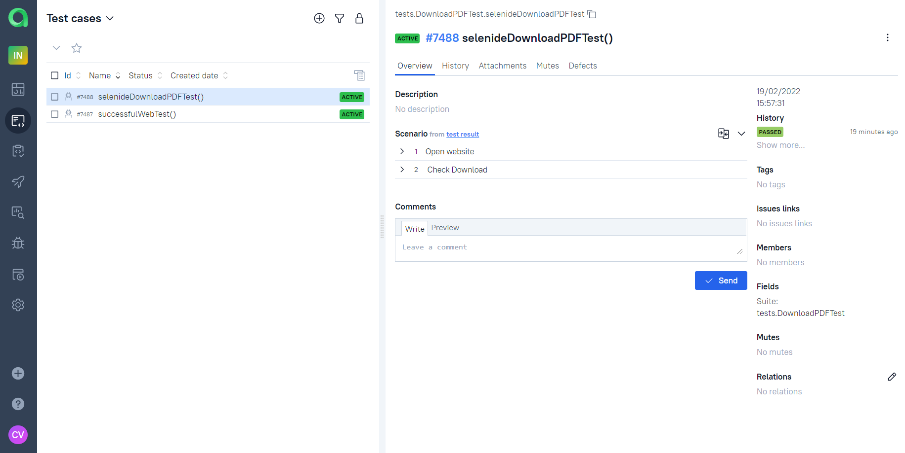
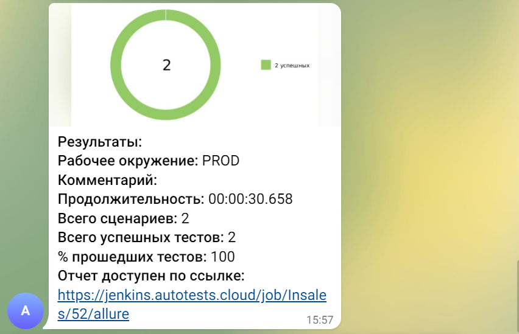

## UI automation testing for https://www.insales.ru/

#### *Quick project example with infrastructure: Selenide UI tests with Allure report, remote run on Selenoid and push notifications to Telegram*

### Technology Stack


## Run locally

If you've downloaded these tests to your computer, run them with the following command:
```bash
gradle clean test
```
### Еxamples of Automated Mobile tests are <a target="_blank" href="https://github.com/Konyaz/Browserstack_dip">here</a> :green_circle:
### Еxamples of Api automation tests are <a target="_blank" href="https://github.com/Konyaz/rest_assured_dip/">here</a> :green_circle:

### Allure report





### Allure TestOps

:bar_chart: Dashboards


:robot: Automated tests can be imported by Allure TestOps as test cases.




### Video :tv:


### Jenkins
Click <a target="_blank" href="https://jenkins.autotests.cloud/job/Insales/build">here</a> to run the tests.


### Telegram


